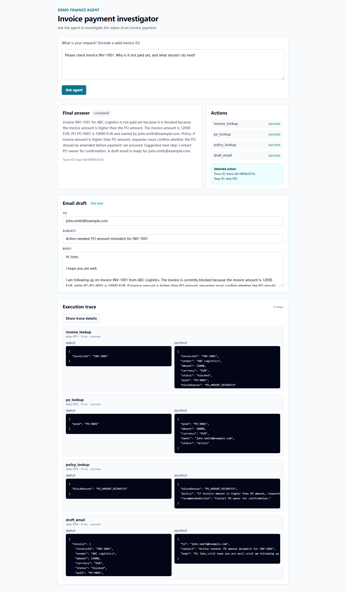

# A prototype of an **AI Agent Task Runner** 

This repository is a full-stack prototype of an AI Agent Task Runner for invoice investigation. A user can ask why an invoice has not been paid, and the app runs a deterministic agent workflow that looks up invoice data, checks the related purchase order and policy, records a structured execution trace, and returns business-readable result and recommendation.

Example request:

```text
Please check invoice INV-1001. Why is it not paid yet, and what should I do next?
```

The implementation intentionally does not call a real LLM API. The planner is rule-based so the behavior is deterministic and easy to test.

## Current Features

- FastAPI backend with RESTful API design for running the agent and fetching traces.
- Tool registry with `invoice_lookup`, `po_lookup`, `policy_lookup`, and `draft_email`.
- Dynamic planning: the agent only calls tools needed for the invoice state.
- Structured trace steps with input, output, status, errors, timestamps, and durations.
- Frontend action list that shows each tool call status.
- Trace details are shown only after the user clicks `Show trace details`.
- PO amount mismatch generates an editable email draft with `to`, `subject`, and `body`.
- Dockerfiles and Docker Compose for running backend and frontend together.

## Screenshot



## Tech Stack

| Area | Stack |
| --- | --- |
| Backend | Python, FastAPI, Pydantic |
| Data Storage | Mock JSON files, in-memory storage |
| Frontend | React, TypeScript, Vite, TailwindCSS |
| Tests | Pytest, FastAPI TestClient, Vitest, React Testing Library |
| Code Quality | ESLint, Prettier |
| DevOps | Docker, Docker Compose, Nginx |

## Project Structure

```text
backend/
  api/routes.py
  agent/
    context.py
    errors.py
    planner.py
    runner.py
    trace.py
  data/
    invoices.json
    policies.json
    purchase_orders.json
  tests/test_agent_api.py
  tools/
    base.py
    data_loader.py
    draft_email.py
    invoice_lookup.py
    policy_lookup.py
    po_lookup.py
    registry.py
  Dockerfile
  main.py
frontend/
  src/
    App.test.tsx
    App.tsx
    EmailDraft.tsx
    main.tsx
    setupTests.ts
    styles.css
  Dockerfile
  nginx.conf
docs/
  screenshots/invoice-agent-main.png
docker-compose.yml
requirements.txt
```

## Mock Data

The backend reads mock JSON files from `backend/data`.

| Invoice | State | Expected Behavior |
| --- | --- | --- |
| `INV-1001` | Blocked, `PO_AMOUNT_MISMATCH` | Calls invoice, PO, policy, and draft email tools. |
| `INV-1002` | Pending approval, `APPROVAL_PENDING` | Calls invoice, PO, and policy tools. No email draft. |
| `INV-1003` | Paid | Stops after invoice lookup. No policy lookup. |
| `INV-1004` | Blocked, unknown policy | Returns a partial answer with `POLICY_NOT_FOUND`. |

Required purchase orders and policies from the product brief are included, plus `PO-9004` for the policy-not-found test path.

## Agent Behavior

The agent flow is:

```text
User request
-> Parse and validate invoice ID
-> Plan the next tool call
-> Execute the tool through ToolRegistry
-> Record the tool result in the trace
-> Update agent context
-> Continue, stop, or return a structured error
-> Build the final business answer
```

Important dynamic behavior:

- Missing invoice ID: returns `needs_input` and does not call tools.
- Invalid invoice ID format: returns `INVALID_INVOICE_ID` and does not call tools.
- Invoice not found: returns `INVOICE_NOT_FOUND` after `invoice_lookup`.
- Paid invoice: returns no-further-action guidance after `invoice_lookup`.
- Blocked invoice with PO: calls `invoice_lookup`, `po_lookup`, and `policy_lookup`.
- PO amount mismatch: also calls `draft_email`.
- Policy not found: returns `partial` with the invoice and PO facts that are available.

## Backend API

### `POST /agent/run`

Runs the finance agent.

Request:

```json
{
  "userRequest": "Please check invoice INV-1001. Why is it not paid yet?"
}
```

Success response shape:

```json
{
  "status": "completed",
  "finalAnswer": "Invoice INV-1001 for ABC Logistics is not paid yet because it is blocked because the invoice amount is higher than the PO amount...",
  "actions": [
    {
      "type": "invoice_lookup",
      "status": "success",
      "traceId": "trace-...",
      "stepId": "step-001"
    }
  ],
  "traceId": "trace-...",
  "draftEmail": {
    "to": "john.smith@example.com",
    "subject": "Action needed: PO amount mismatch for INV-1001",
    "body": "Hi John,\n\nI hope you are well..."
  }
}
```

Errors are structured:

```json
{
  "status": "failed",
  "finalAnswer": "Invoice INV-9999 was not found.",
  "actions": [
    {
      "type": "invoice_lookup",
      "status": "failed",
      "traceId": "trace-...",
      "stepId": "step-001"
    }
  ],
  "traceId": "trace-...",
  "error": {
    "errorCode": "INVOICE_NOT_FOUND",
    "message": "Invoice INV-9999 was not found.",
    "recoverable": true
  }
}
```

Supported statuses:

- `completed`: full answer was generated.
- `partial`: policy lookup failed, but invoice and PO context were available.
- `needs_input`: the request did not include an invoice ID.
- `failed`: validation, lookup, or tool execution failure.

### `GET /agent/traces/{traceId}`

Returns the full structured trace for a previous run.

Each step includes:

```json
{
  "stepId": "step-001",
  "stepName": "invoice_lookup",
  "toolName": "invoice_lookup",
  "input": {
    "invoiceId": "INV-1001"
  },
  "output": {
    "invoiceId": "INV-1001",
    "status": "blocked",
    "blockReason": "PO_AMOUNT_MISMATCH"
  },
  "status": "success",
  "error": null,
  "startedAt": "2026-06-28T10:00:00Z",
  "durationMs": 12
}
```

Traces are currently stored in memory on the backend process. Restarting the backend clears existing trace IDs.

## Frontend Behavior

The frontend provides:

- A request text area and `Ask agent` submit button.
- A final answer panel with run status and trace ID.
- An Actions panel showing tool name and success/failure status.
- Action click behavior that reveals trace ID and step ID only.
- An editable Email draft panel for PO amount mismatch cases.
- An Execution trace panel where tool inputs and outputs remain hidden until `Show trace details` is clicked.
- Clear error display for structured backend errors and empty frontend submissions.

## Local Development

### Backend

Install dependencies:

```powershell
python -m pip install -r requirements.txt
```

Run the API:

```powershell
python -m uvicorn backend.main:app --host 127.0.0.1 --port 8000 --reload
```

Try the run endpoint:

```powershell
Invoke-WebRequest `
  -Uri "http://127.0.0.1:8000/agent/run" `
  -Method Post `
  -ContentType "application/json" `
  -Body '{"userRequest":"Please check invoice INV-1001"}'
```

### Frontend

Install dependencies:

```powershell
cd frontend
npm install
```

Run the dev server:

```powershell
npm run dev
```

Open:

```text
http://127.0.0.1:5173
```

## Docker Compose

Run both services from the repository root:

```powershell
docker compose up --build
```

Then open:

```text
http://127.0.0.1:5173
```

Compose services:

| Service | Container | Host URL |
| --- | --- | --- |
| Frontend | `finance-agent-frontend` | `http://127.0.0.1:5173` |
| Backend | `finance-agent-backend` | `http://127.0.0.1:8000` |

## Testing and Quality Checks

Backend tests:

```powershell
python -m pytest backend\tests
```

Frontend tests:

```powershell
cd frontend
npm test
```

Frontend build, lint, and formatting:

```powershell
npm run build
npm run lint
npm run format
```

Current automated coverage:

| Area | Coverage |
| --- | --- |
| Backend API | 14 tests covering success paths, dynamic planning, structured errors, trace lookup, draft email, and unexpected tool output. |
| Frontend UI | 4 tests covering action summaries, explicit trace loading, editable email draft, structured errors, no-draft cases, and empty request prevention. |

## Limitations

- The planner is deterministic and rule-based, not powered by an LLM.
- Data is mock JSON, not a database.
- Trace storage is in memory only.
- The `draft_email` tool creates draft content only; it never sends email.
